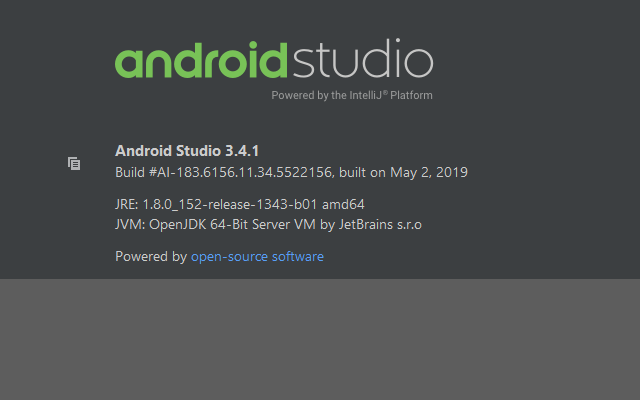
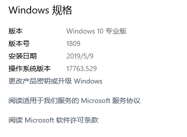
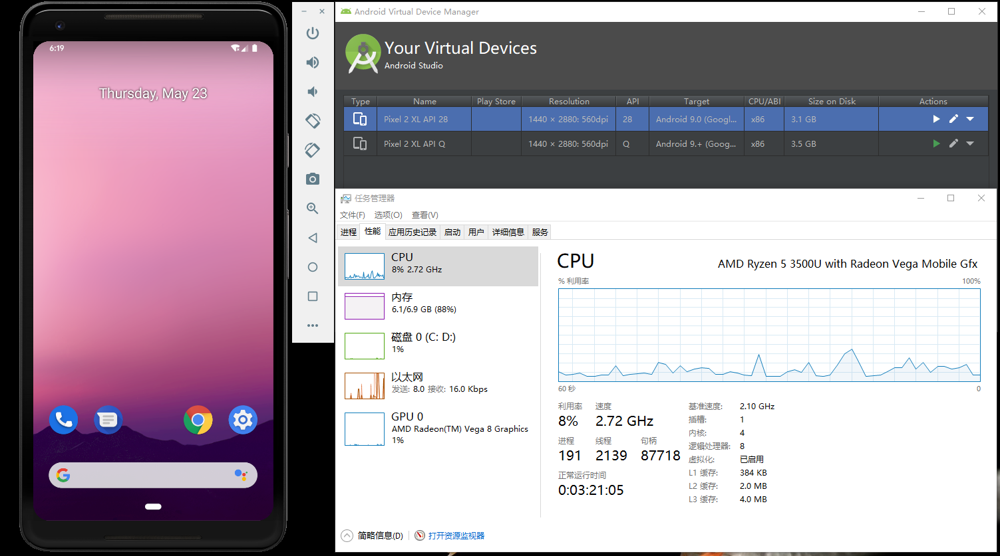

# AMD Ryzen 启动 Android Studio Emulator 虚拟机

## 先决条件
- AMD Processor - Recommended: AMD® Ryzen™ processors
- Android Studio 3.2 Beta or higher
- Android Emulator v27.3.8+
- x86 Android Virtual Device (AVD)
- Windows 10 with April 2018 Update
- Enable via Windows Features: "Windows Hypervisor Platform"

## 环境准备

### 1.在 BIOS 设置中开启虚拟化技术(SVM)
各机器开启方法略有不同, 自行 Google 开启方法.
 
### 2.启用 "Windows Hypervisor Platform" (不是 "Hyper-V")
1.打开 `控制面板` → `程序` → `程序和功能` → `启用或关闭 Windows 功能`.  
2.勾选 `Windows Hypervisor Platform`.  
3.确定后等待完成并**重启机器**.  

### 3.检查 Android Studio 以及 Android Emulator 版本(如果你安装的是最新版本, 请忽略这一步.)
Android Studio 版本 大于等于 `3.2 Beta`.  

Android Emulator 版本 大于等于 `27.3.8`.  
打开 Android Studio 的设置页, 依次点开 `Appearance & Behavior` → `System Settings` → `Android SDK` → `SDK Tools` 即可查看.

### 4.检查 Windows 10 版本
确保你的系统版本大于等于`1803`.  
个人建议将你的 Windows10 更新到当前版本号的最新稳定版(不更新系统甚至是破坏系统更新是一种愚蠢的行为).  

## 实测
现在你可以像使用 Intel 平台一样去创建虚拟机(`x86`镜像)并去启动他了.

### 测试环境
- MagicBook 2019(KPR-WX9)  
- AMD Ryzen 5 3500U with Radeon Vega Mobile Gfx (8 CPUs)  
- Android Studio 3.4.1
- Android Emulator v29.0.9
- Windows 10 Pro 64-bit (1809-17763.529)

### 测试结果
请忽略内存爆炸...

[参考: Android Emulator - AMD Processor & Hyper-V Support](https://android-developers.googleblog.com/2018/07/android-emulator-amd-processor-hyper-v.html)
