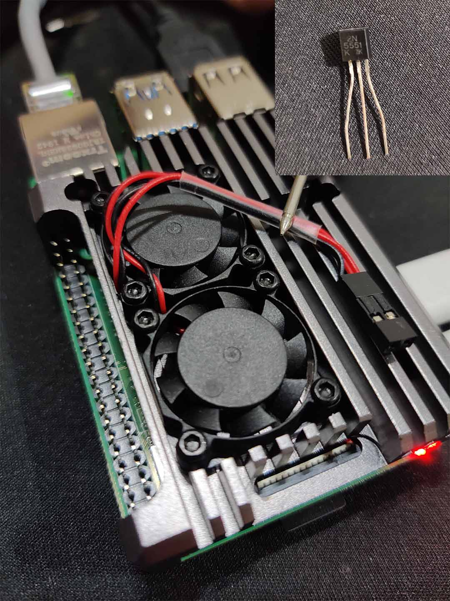
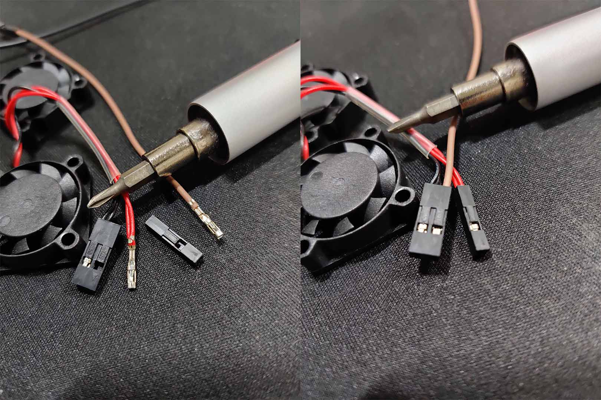
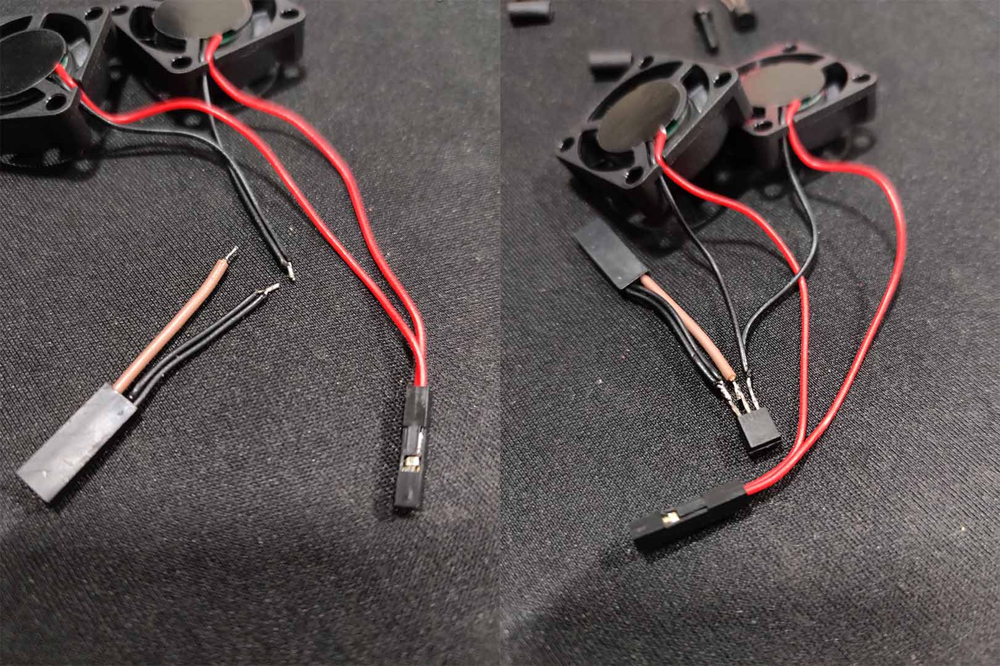
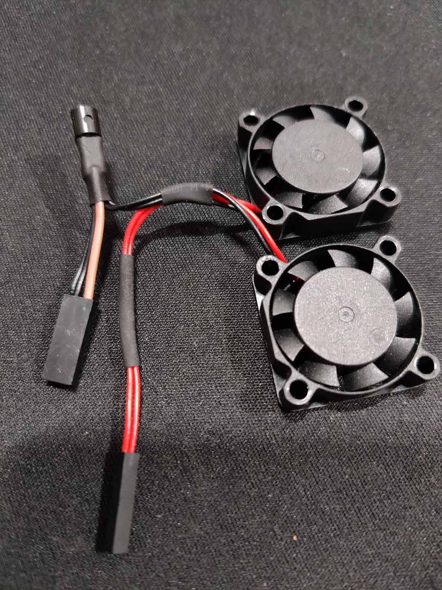
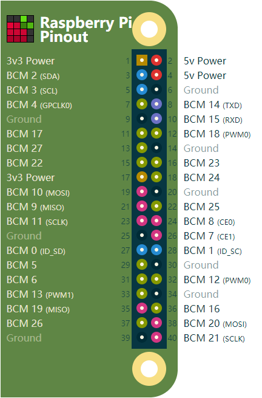
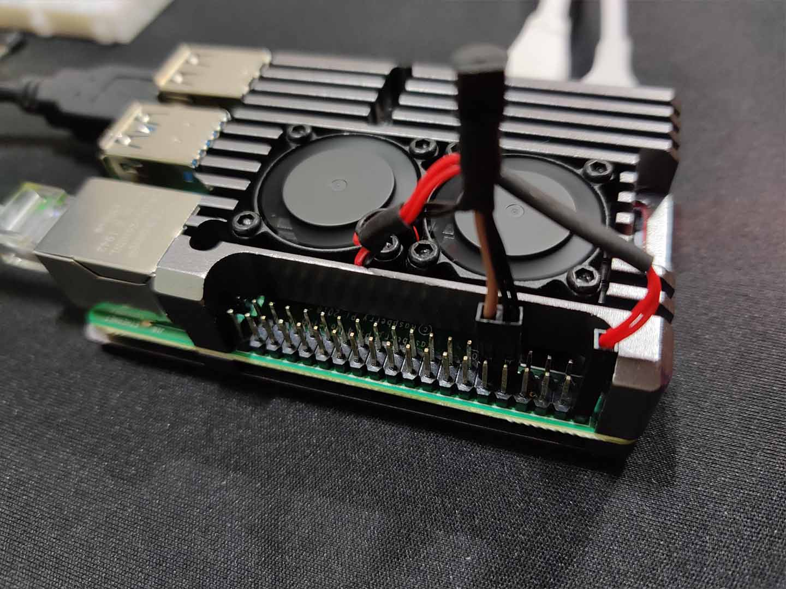

# 树莓派温控散热风扇
根据树莓派 SoC 的温度智能自动控制风扇的开关, 满足条件: 当温度过高是开启风扇, 温度适宜时关闭风扇.

## 获取SoC实时温度
通过读取 `/sys/class/thermal/thermal_zone0/temp` 可以得到一个温度值, 根据[RaspberryPi官方文档](https://www.raspberrypi.org/documentation/hardware/raspberrypi/frequency-management.md)介绍, 
并没有独立监控 CPU 温度或者 GPU 温度的传感器, 所以通过该文件获取到的温度实际上是整个 SoC 芯片的温度; 但是 CPU 和 GPU 都在这个芯片上, 所以我以这个温度作为温控阈值参考.

#### 通过以下命令可以查看当前SoC温度(结果除以1000, 单位/℃)
```shell script
pi@raspberrypi:~ $ cat /sys/class/thermal/thermal_zone0/temp
42425
```

## 风扇供电问题
### 可以通过 GPIO 针脚直接供电驱动吗?
**我们无法直接通过 GPIO 来驱动风扇并控制它的开关,** 因为根据[RaspberryPi官方FAQ文档](https://www.raspberrypi.org/documentation/faqs/#pi-power)介绍, 
GPIO 的输出电压是 3.3V, 并且安全的最高电流输出是 16mA, 峰值为50mA, 某些 GPIO 针脚默认输出 8mA; 所以即使你的风扇额定电压为 3V, 这么小的电流也难以驱动它, 即使能驱动也不推荐这么干, 一个原因是可能会损坏树莓派, 
根据[RaspberryPi官方GPIO使用文档](https://www.raspberrypi.org/documentation/usage/gpio/README.md)明确的警告指出, 不能将电机直接接在 GPIO 针脚上(风扇实际上就是由电机驱动的), 另一个是通过这么小电流驱动的风扇真的能起到散热作用吗? 

### 通过 5V 针脚或者 3V3 针脚供电
[Pinout 5V针脚文档](https://pinout.xyz/pinout/pin2_5v_power)中指出树莓派的 5V 针脚是直接连通到电源的, 使用 5V 针脚相当于与树莓派并联使用一个电源适配器, 所以根据 "并联分流" 该针脚能提供的电流实际上就等于:
 `(电源适配器的额定最高电流) - (树莓派本身运行所占用的电流)`, 所以假设你使用符合要求的电源适配器, 5V 针脚是完全可以直接驱动额定电压为 5V 的风扇.  
而树莓派的 3V3 针脚, [Pinout 3V3针脚文档](https://pinout.xyz/pinout/pin1_3v3_power)中也指出了在型号 B+ 之前的电流最高能提供 50mA, 但是在 B+ 之后的树莓派, 3V3 针脚则可以提供高达 500mA 的电流; 
所以当使用额定电压为 3V 的风扇时, 使用 3V3 针脚也是可以直接安全的驱动风扇滴.


## 如何控制风扇的开关?
当直接将风扇接到合适的电源上, 风扇是始终处于运行状态. 现在我需要根据 SoC 的温度来自动控制它的开关, 所以可以通过给**风扇与电源连接之间加一个开关**, 然后通过某一个 **GPIO 针脚控制该开关**, 而对该 GPIO 针脚的控制则可以通过代码**获取 SoC 的温度**, 
并根据**判断温度阈值启停**也就是开或者关风扇. 最终实现对风扇的自动开关控制.

### 使用三极管作为风扇开关
选用合适的三级管,当它仅工作在 **截止状态** 和 **饱和状态** 时, 那么该三极管就可以是视作为一个开关.

### 使用 Python 控制风扇
使用以下代码时, 你最有可能修改的是高亮部分的代码
#### auto_fan.py
```python {8,9,10}
#!/usr/bin/python
# -*- coding: utf-8 -*-
from RPi import GPIO
from time import sleep

GPIO.setmode(GPIO.BCM) # 使用BCM引脚模式

channel = 17    # 使用BCM17(对应物理引脚号11)接口控制开关
start_temp = 55 # 启动风扇的温度阈值(℃)
end_temp = 48   # 关闭风扇的温度阈值(℃)

GPIO.setup(channel, GPIO.OUT, initial = GPIO.LOW) # 初始化控制引脚
is_high = GPIO.LOW # 用于标记风扇是否打开 避免频繁调用output

try:
    while True:
        # 获取当前SoC温度
        temp = open('/sys/class/thermal/thermal_zone0/temp')
        temp = int(temp.read()) / 1000

        if temp > start_temp and not is_high: # 当SoC温度超过启动阈值且风扇处于关闭状态
            GPIO.output(channel, GPIO.HIGH)   # 打开风扇
            is_high = GPIO.HIGH               # 标记风扇状态为打开

        elif temp < end_temp and is_high:     # 当SoC温度低于关闭阈值且风扇处于打开状态
            GPIO.output(channel, GPIO.LOW)    # 关闭风扇
            is_high = GPIO.LOW                # 标记风扇状态为关闭

        sleep(10) # 每隔10秒监控一次
except:
    pass
# 退出时 重置该引脚
GPIO.cleanup(channel)
```
::: tip 关于阈值的选取
这个范围根据自己的喜欢可以自行决定, 我这里选取是根据[RaspberryPi官方文档](https://www.raspberrypi.org/documentation/hardware/raspberrypi/frequency-management.md)对过热保护控制的措施决定的.   
硬限制为 85℃, 这个温度太高了, 我不希望我的树莓派到达这个温度才启动风扇.  
软限制为 60℃, 这个温度看起来可以接受.  
所以为了避免树莓派触发软限制, 我选取一个接近 60℃ 但又不会迅速达到 60℃ 的温度 55℃; 这是启动风扇的温度, 
为了避免风扇频繁的在阈值边界开开关关, 关闭风扇的温度可以比启动风扇的温度低几度, 我这里选取 48℃.
:::

## 下面进行实测
### 实际用到的设备和元器件:
- RaspberryPi 4B
- 2个 5V/100mA 散热风扇
- NPN 三极管 2N5551

这个 `2N5551` 是我随便从积灰的零件工具箱里随手翻出来的, 针脚都有点生锈了(真的很随便, 摸到哪个用哪个, 拿的时候啥型号也没注意看, 是三极管就行😂).  


### 接线准备
#### 针脚调整
我要在风扇负极上加装三极管开关, 并希望负极与用于控制的 GPIO 接口相邻, 所以我把正极抽出来, 并与另一条相同接头的杜邦线交换接头; 得到负极与 GPIO 相邻双 pin 接头, 正极独立单 pin 接头. 如下图所示:  


#### 在负极上加装三极管
::: tip NPN三极管针脚识别
有字的一面正对自己, 引脚向下, 三跟引脚从左到右分别是:  
E-发射极、B-基极、C-集电极.  

:::

把负极从中间剪断, 并将 GPIO 线也剪短至一样的长度, 然后将 GPIO 线与三极管的中间引脚也就是**B-基极**连接.

::: warning 关于三极管进入饱和状态所需的电压
查阅资料后发现 `2N5551` 的饱和状态电压是 1V, 而 GPIO 的输出电压是 3.3V, 所以理论上要在它们之间串联一个适当的电阻来控制电压, 但是我在实际面包板测试中, 对 `2N5551` 的基极接入 3.3V 一定时间后并没有产生发热现象, 所以最终风扇改装我并没有在它们之间加装电阻.
:::  

然后再将负极剪断的两端分别接在三极管的左右两端, 分别是**E-发射极**和**C-集电极**;  
保险的接法是从风扇出来那条线(它虽然在风扇的负极, 但是对于三极管来说它带正电)接在**C-集电极**, 带接头与 GPIO 线相邻的那条线接在**E-发射极**.

::: tip 关于三极管的电流方向
你可能注意到, 我的接线与上述是相反的. 理论上三极管集电极和发射极之间的电流方向是从集电极流向发射极, 如图所示:  
  
但是用作开关仅工作在 **截止状态** 和 **饱和状态** 的三级管似乎在这个时候对极性并没有要求, 因为在饱和状态下, 集电极跟发射极之间理论上是相当于短路的, 所以怎么接应该都没问题. 
在我实际面包板测试中, 无论是正接还是反接, 都可以正常控制风扇的开关; 所以, 在下图接线的时候也是很随便的随手抓到哪个线就接哪根线🙃.
:::



#### 对线材以及接口处进行绝缘处理
我使用的是热缩管  


### 安装到树莓派4B
将风扇正极接到物理针脚位置 2 或者 4 上, 这两个都是 5V; 根据之前对接口的调整, 风扇的负极跟 GPIO 是相邻的, 所以我选取物理接口 9(接地/负极) 跟 11(BCM17)插入这两根线.  



#### 上机效果图



### 运行温控程序 auto_fan.py
在你创建该程序的目录下执行命令: `python auto_fan.py`
```shell script
pi@raspberrypi:~ $ python auto_fan.py
```
在使用官方 Raspbian 桌面版时测试通过, 其他系统可能会出现环境问题. 可自行 Google 解决👌

## 还能做些什么?
- 你可以将该 python 程序加入系统自启, 方便重启后不用手动执行.
- 你可能不只是希望控制风扇的开或者关, 你还想根据温度控制风扇的转速?😜
