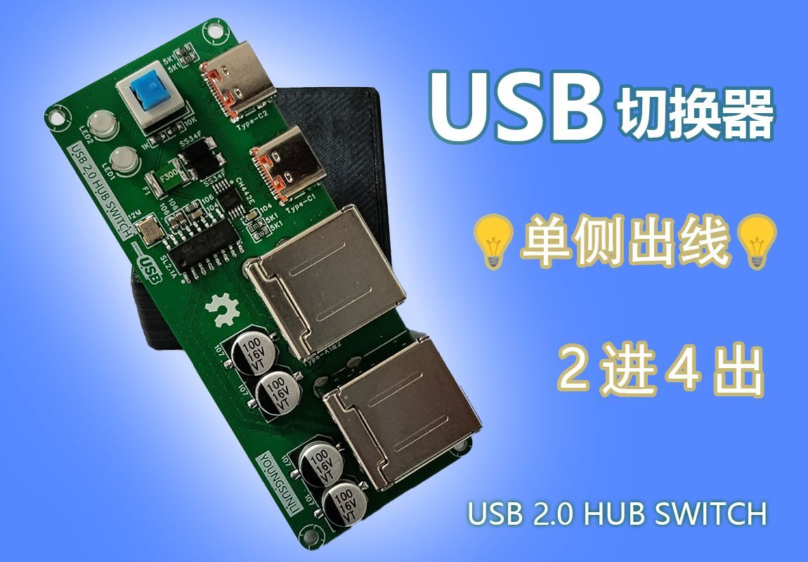
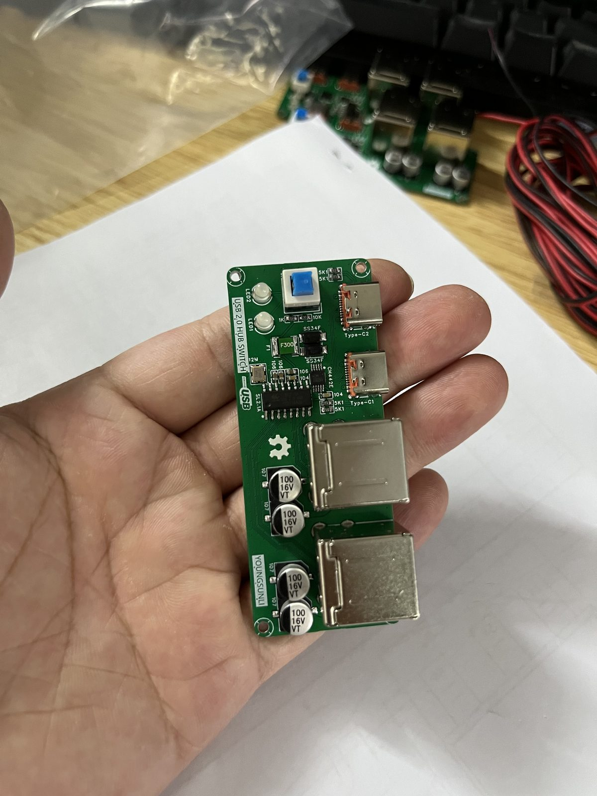
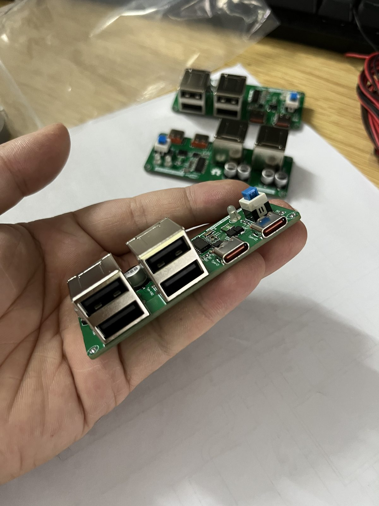
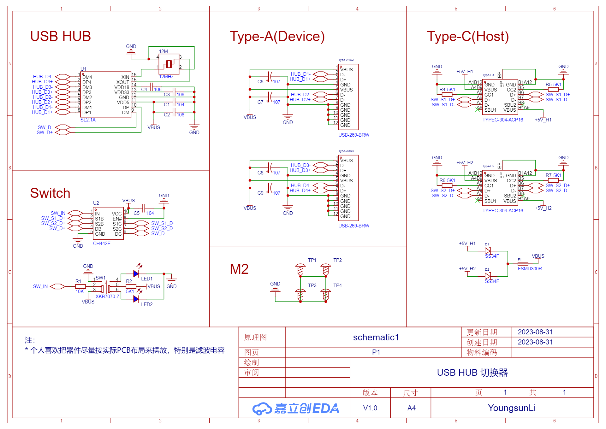
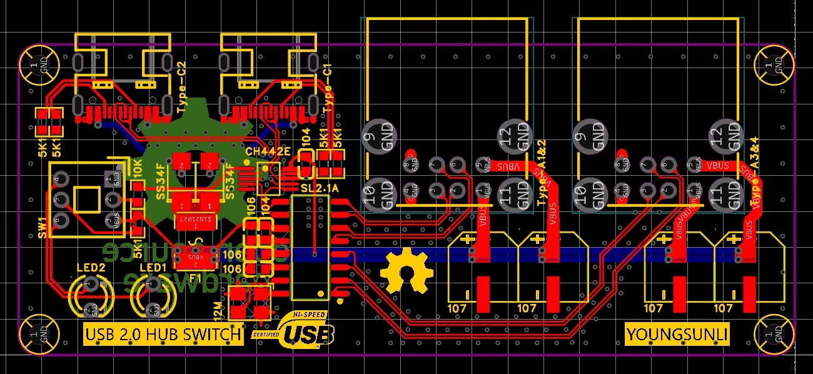
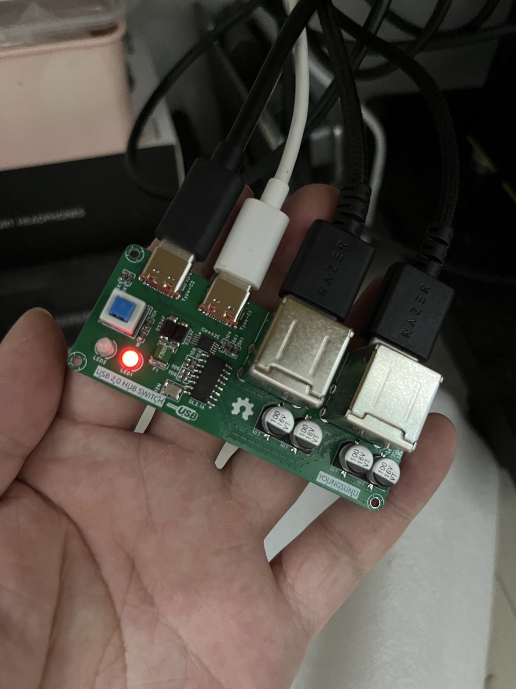
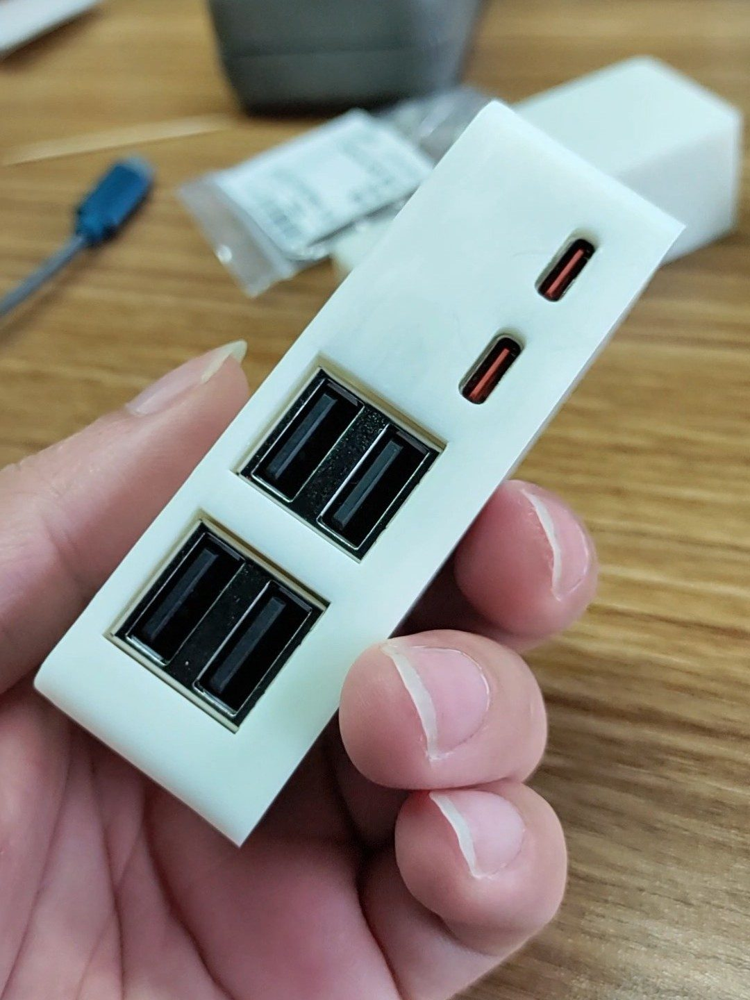

# 迷你 USB HUB 切换器

一个支持在 **2 台主机设备** 之间一键切换 **4 个 USB 设备** 的 USB 2.0 HUB 切换器 (2 进 4 出).

## 特点

体积小巧精致, **💡单侧出线💡**, 比四面八方出线的, 更适合直接放在桌面, 不需要延长按钮也可以让桌面保持整洁.

## 原理图与 PCB

完整工程已开源到立创开源硬件平台: [USB HUB 切换器](https://oshwhub.com/youngsunli/USB-HUB-qie-huan-qi) (GPL 3.0), 可以直接打开或复刻.

## 其他说明

- 原理图个人喜欢把器件尽量按实际 PCB 布局来摆放, 特别是滤波电容.
- 不计划考虑 `TVS`, 但是芯片自带 `ESD` 保护 (HBM 级别).
- 不计划考虑独立供电, 因为双主机接入时, 供电是充足的; 单主机时, 另一个 `Type-C` 可以接供电, 不过注意选择压降低的二极管, 我这里是 `SS34F`.
- 自恢复保险丝 `F1` 可以选择封装大小差不多, 保持电流小一点, 动作时间快一点的, 这样更安全, 我这里考虑到需要给 USB 设备充电才选的 3A; 不建议一堆锡连过来, 因为 `F1` 可以预防大电流短路烧坏电脑主板.
- `SL2.1A` 的外置晶振不需要加额外的负载电容.
- `LED` 指示灯建议使用雾状的或者灯珠带颜色的; 另外 `R2` 使用 `5K1` 阻值是为了亮度低点不那么刺眼, 同时避免发热影响 `F1`.
- `SW1` 裸板使用的建议选用平头的; 另外不要问我为什么 `SW1` 就可以实现 2 路单刀双掷还要加一个开关芯片🤣.

::: tip 实际使用
实际使用了三个多月, 非常稳定, 可放心复刻. 不足之处希望各位大佬指出✍🏻
:::
